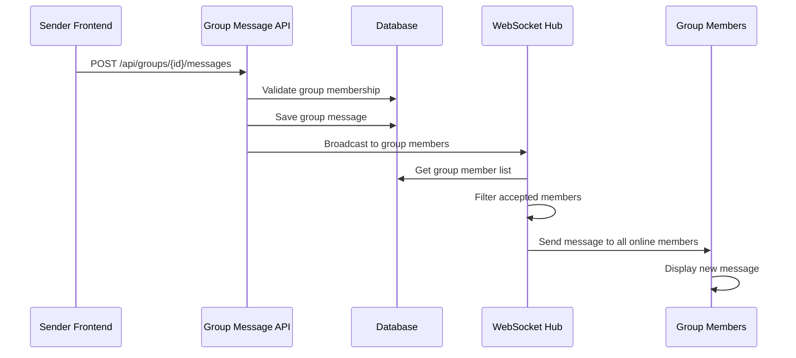
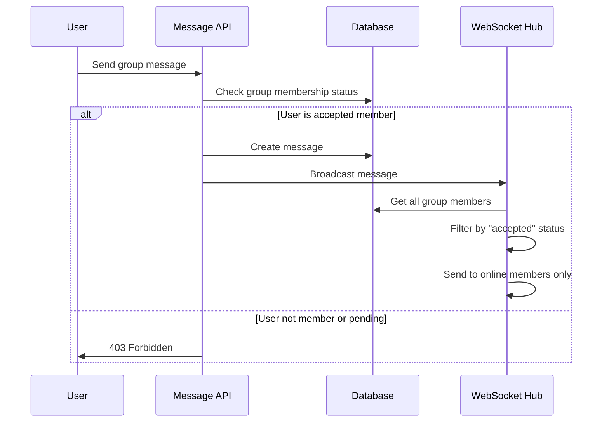
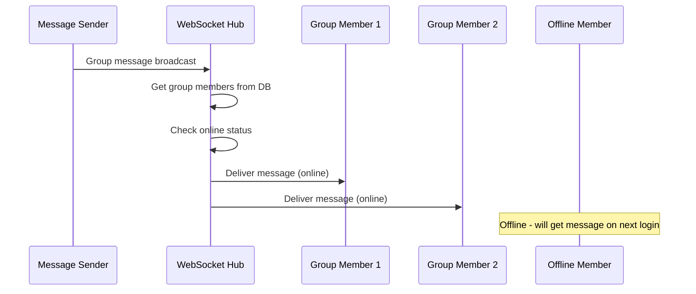

# Real-time Group Chat WebSocket Documentation

## Overview

The group chat system extends the private messaging WebSocket infrastructure to support multi-user conversations within groups. This document details the architecture, message broadcasting, member validation, and real-time features specific to group communications.

## Architecture

### Backend Components

#### 1. Group Message Broadcasting (`backend/pkg/websocket/hub.go`)
The WebSocket hub handles group message distribution with member validation.

```go
case "group", "group_message":
    // Get group members from database
    members, err := models.GetGroupMembers(h.db, int(groupID))
    if err != nil {
        log.Printf("Failed to get group members: %v", err)
        continue
    }

    // Create a map of member user IDs for quick lookup
    memberIDs := make(map[int]bool)
    for _, member := range members {
        if member.Status == "accepted" {
            memberIDs[member.UserID] = true
        }
    }

    // Broadcast to all connected clients who are group members
    for client := range h.clients {
        if memberIDs[client.UserID] {
            select {
            case client.Send <- message:
            default:
                // Handle failed send
            }
        }
    }
```

**Key Features:**
- **Member Validation**: Only accepted group members receive messages
- **Efficient Broadcasting**: Uses member ID mapping for fast lookups
- **Permission Checking**: Database validation before message delivery
- **Connection Management**: Handles failed sends gracefully

#### 2. Group Message Handler (`backend/pkg/handlers/message.go`)
Processes group message API calls and triggers WebSocket broadcasts.

```go
func (h *MessageHandler) SendGroupMessage(w http.ResponseWriter, r *http.Request) {
    // Validate group membership
    // Create group message
    messageID, err := models.CreateGroupMessage(h.db, user.ID, groupID, req.Content)
    
    // Get the created message with full details
    message, err := models.GetMessageByID(h.db, messageID)
    
    // Broadcast message via WebSocket for real-time delivery
    h.broadcastGroupMessage(message, groupID)
}

func (h *MessageHandler) broadcastGroupMessage(message *models.Message, groupID int) {
    wsMessage := map[string]interface{}{
        "type":      "group_message",
        "sender_id": float64(message.SenderID),
        "group_id":  float64(groupID),
        "message":   message,
    }
    h.hub.SendMessage(messageBytes)
}
```

#### 3. Group Message Model (`backend/pkg/models/message.go`)
Handles group message creation and retrieval with permission validation.

```go
func CreateGroupMessage(db *sql.DB, senderId int, groupId int, content string) (int, error) {
    // Check if user is a member of the group
    var status string
    err := db.QueryRow(
        "SELECT status FROM group_members WHERE group_id = ? AND user_id = ?",
        groupId, senderId,
    ).Scan(&status)
    
    if status != "accepted" {
        return 0, errors.New("user is not an accepted member of the group")
    }
    
    // Create message
    result, err := db.Exec(
        `INSERT INTO messages (sender_id, group_id, content) VALUES (?, ?, ?)`,
        senderId, groupId, content,
    )
}
```

### Frontend Components

#### 1. Group Chat Interface (`frontend/src/components/chat/GroupChatInterface.jsx`)
Main component for group chat functionality.

```javascript
// WebSocket message handling for groups
useEffect(() => {
    if (!user || !group) return;

    const handleWebSocketMessage = (data) => {
        if (data.type === 'group_message' && data.group_id === group.id) {
            const newMessage = data.message;
            setMessageList(prev => {
                // Remove optimistic messages and add real message
                const filteredMessages = prev.filter(msg => 
                    !msg.id.toString().startsWith('temp-')
                );
                
                // Check if real message already exists (avoid duplicates)
                const exists = filteredMessages.some(msg => msg.id === newMessage.id);
                if (exists) return prev;

                return [...filteredMessages, newMessage];
            });
            setTimeout(scrollToBottom, 100);
        }
    };

    // Connect to WebSocket
    wsRef.current = connectWebSocket(handleWebSocketMessage);
}, [user, group]);
```

## Message Flow

### 1. Group Message Broadcasting



### 2. Member Validation Flow



### 3. Real-time Message Delivery



## WebSocket Message Types

### 1. Group Messages
```json
{
    "type": "group_message",
    "sender_id": 123,
    "group_id": 456,
    "message": {
        "id": 789,
        "content": "Hello everyone!",
        "sender_id": 123,
        "group_id": 456,
        "created_at": "2024-01-01T12:00:00Z",
        "sender": {
            "id": 123,
            "first_name": "John",
            "last_name": "Doe",
            "avatar": "/uploads/avatar.jpg",
            "nickname": "johnd"
        }
    }
}
```

### 2. Group Typing Indicators (Future Enhancement)
```json
{
    "type": "group_typing_indicator",
    "user_id": 123,
    "group_id": 456,
    "is_typing": true,
    "user_name": "John Doe"
}
```

### 3. Group Member Status Updates
```json
{
    "type": "group_member_update",
    "group_id": 456,
    "user_id": 123,
    "action": "joined|left|promoted|demoted",
    "user_name": "John Doe"
}
```

## Real-time Features

### 1. Optimistic UI Updates
Group chat uses the same optimistic UI pattern as private messaging.

```javascript
// Create optimistic message
const optimisticMessage = {
    id: `temp-${Date.now()}`,
    content: content.trim(),
    sender_id: user.id,
    group_id: group.id,
    created_at: new Date().toISOString(),
    sender: {
        id: user.id,
        first_name: user.first_name,
        last_name: user.last_name,
        avatar: user.avatar,
        nickname: user.nickname
    }
};

// Add optimistic message immediately
setMessageList(prev => [...prev, optimisticMessage]);

// Send to API
await messages.sendGroupMessage(group.id, content.trim());
// Real message will replace optimistic via WebSocket
```

### 2. Message Deduplication
Prevents duplicate messages when multiple WebSocket events occur.

```javascript
setMessageList(prev => {
    // Remove any optimistic message with temp ID
    const filteredMessages = prev.filter(msg => 
        !msg.id.toString().startsWith('temp-')
    );

    // Check if real message already exists (avoid duplicates)
    const exists = filteredMessages.some(msg => msg.id === newMessage.id);
    if (exists) return prev;

    return [...filteredMessages, newMessage];
});
```

### 3. Group-specific UI Elements
- **Group avatar display**: Shows sender avatars for all messages
- **Sender identification**: Clear indication of who sent each message
- **Timestamp grouping**: Groups messages by sender and time
- **Member count**: Real-time member count updates

## Security & Permissions

### 1. Group Membership Validation
Every group message operation validates membership:

```go
// Check if user is a member of the group
var status string
err := db.QueryRow(
    "SELECT status FROM group_members WHERE group_id = ? AND user_id = ?",
    groupId, senderId,
).Scan(&status)

if status != "accepted" {
    return 0, errors.New("user is not an accepted member of the group")
}
```

### 2. Message Broadcasting Security
- Only accepted group members receive messages
- Pending/rejected members are excluded
- Database validation before every broadcast
- No message leakage to non-members

### 3. Permission Levels
- **Accepted Members**: Can send and receive messages
- **Pending Members**: Cannot send or receive messages
- **Rejected Members**: No access to group messages
- **Group Admins**: Additional permissions (future enhancement)

## Performance Considerations

### 1. Efficient Member Lookup
```go
// Create a map of member user IDs for quick lookup
memberIDs := make(map[int]bool)
for _, member := range members {
    if member.Status == "accepted" {
        memberIDs[member.UserID] = true
    }
}

// O(1) lookup for each connected client
for client := range h.clients {
    if memberIDs[client.UserID] {
        // Send message
    }
}
```

### 2. Database Optimization
- **Indexed Queries**: Group membership queries use proper indexes
- **Batch Operations**: Efficient member list retrieval
- **Connection Pooling**: Reuse database connections

### 3. Memory Management
- **Client Mapping**: Efficient user-to-client mapping
- **Message Cleanup**: Proper cleanup of failed connections
- **Resource Limits**: Message size and rate limiting

## Error Handling

### 1. Failed Message Delivery
```go
select {
case client.Send <- message:
    // Message sent successfully
default:
    // Client channel is full or closed
    close(client.Send)
    delete(h.clients, client)
    h.removeUserClient(client.UserID, client)
}
```

### 2. Group Permission Errors
- **403 Forbidden**: User not a group member
- **404 Not Found**: Group doesn't exist
- **400 Bad Request**: Invalid message content

### 3. WebSocket Connection Issues
- **Auto-reconnection**: Automatic reconnection on connection loss
- **Message Queuing**: Queue messages during disconnection
- **Graceful Degradation**: Fall back to polling if WebSocket fails

## Monitoring & Analytics

### 1. Group Activity Metrics
- Messages per group per time period
- Active members in each group
- Message delivery success rates
- Connection health per group

### 2. Performance Monitoring
- Message broadcast latency
- Database query performance
- WebSocket connection counts
- Memory usage per group

### 3. Error Tracking
- Failed message deliveries
- Permission violations
- Connection failures
- Database errors

## Future Enhancements

### 1. Advanced Group Features
- **Typing Indicators**: Show who's typing in group
- **Message Reactions**: React to group messages
- **Message Threading**: Reply to specific messages
- **Message Mentions**: @mention specific users

### 2. Group Management
- **Real-time Member Updates**: Live member join/leave notifications
- **Role-based Permissions**: Admin, moderator, member roles
- **Message Moderation**: Delete/edit message capabilities
- **Group Settings**: Configurable group behavior

### 3. Performance Improvements
- **Message Pagination**: Efficient loading of message history
- **Selective Broadcasting**: Send only to active group viewers
- **Message Compression**: Reduce WebSocket payload sizes
- **Caching**: Cache group member lists for better performance

### 4. Rich Media Support
- **File Sharing**: Share files within groups
- **Image/Video**: Multimedia message support
- **Voice Messages**: Audio message capabilities
- **Screen Sharing**: Share screens in group context

## Implementation Examples

### 1. Frontend Group Message Handling
```javascript
// GroupChatInterface.jsx - Complete message handling
const handleWebSocketMessage = (data) => {
    if (data.type === 'group_message' && data.group_id === group.id) {
        const newMessage = data.message;

        setMessageList(prev => {
            // Remove optimistic messages
            const filteredMessages = prev.filter(msg =>
                !msg.id.toString().startsWith('temp-')
            );

            // Prevent duplicates
            const exists = filteredMessages.some(msg => msg.id === newMessage.id);
            if (exists) return prev;

            // Add new message and sort by timestamp
            const updatedMessages = [...filteredMessages, newMessage];
            return updatedMessages.sort((a, b) =>
                new Date(a.created_at) - new Date(b.created_at)
            );
        });

        // Auto-scroll to bottom
        setTimeout(scrollToBottom, 100);

        // Play notification sound if not sender
        if (newMessage.sender_id !== user.id) {
            playNotificationSound();
        }
    }
};
```

### 2. Backend Group Broadcasting
```go
// hub.go - Complete group message broadcasting
func (h *Hub) broadcastGroupMessage(groupID int, message []byte) {
    // Get group members with caching
    members, err := h.getGroupMembersWithCache(groupID)
    if err != nil {
        log.Printf("Failed to get group members: %v", err)
        return
    }

    // Create member lookup map
    memberIDs := make(map[int]bool)
    for _, member := range members {
        if member.Status == "accepted" {
            memberIDs[member.UserID] = true
        }
    }

    // Track delivery statistics
    delivered := 0
    failed := 0

    // Broadcast to all connected group members
    for client := range h.clients {
        if memberIDs[client.UserID] {
            select {
            case client.Send <- message:
                delivered++
            default:
                failed++
                // Clean up failed connection
                close(client.Send)
                delete(h.clients, client)
                h.removeUserClient(client.UserID, client)
            }
        }
    }

    // Log delivery statistics
    log.Printf("Group %d message delivered to %d clients, %d failed",
        groupID, delivered, failed)
}
```

### 3. Database Schema for Group Messages
```sql
-- Messages table with group support
CREATE TABLE messages (
    id INTEGER PRIMARY KEY AUTOINCREMENT,
    sender_id INTEGER NOT NULL,
    receiver_id INTEGER NULL,          -- For private messages
    group_id INTEGER NULL,             -- For group messages
    content TEXT NOT NULL,
    is_read BOOLEAN DEFAULT FALSE,
    created_at TIMESTAMP DEFAULT CURRENT_TIMESTAMP,
    updated_at TIMESTAMP DEFAULT CURRENT_TIMESTAMP,

    FOREIGN KEY (sender_id) REFERENCES users(id),
    FOREIGN KEY (receiver_id) REFERENCES users(id),
    FOREIGN KEY (group_id) REFERENCES groups(id),

    -- Ensure either receiver_id OR group_id is set, not both
    CHECK ((receiver_id IS NULL) != (group_id IS NULL))
);

-- Indexes for performance
CREATE INDEX idx_messages_group_id ON messages(group_id);
CREATE INDEX idx_messages_created_at ON messages(created_at);
CREATE INDEX idx_group_members_lookup ON group_members(group_id, user_id, status);
```

## Troubleshooting Guide

### 1. Common Issues

#### Messages Not Appearing in Real-time
**Symptoms**: Messages appear only after page refresh
**Causes**:
- WebSocket connection lost
- User not in group member list
- Message type filtering issue

**Solutions**:
```javascript
// Check WebSocket connection status
if (!websocket || websocket.readyState !== WebSocket.OPEN) {
    console.log('WebSocket not connected, attempting reconnection...');
    reconnectWebSocket();
}

// Verify group membership
const checkMembership = async () => {
    try {
        const members = await groups.getMembers(groupId);
        const isMember = members.some(m => m.user_id === user.id && m.status === 'accepted');
        if (!isMember) {
            console.error('User is not an accepted group member');
        }
    } catch (error) {
        console.error('Failed to check group membership:', error);
    }
};
```

#### Duplicate Messages
**Symptoms**: Same message appears multiple times
**Causes**:
- Multiple WebSocket connections
- Optimistic message not properly replaced
- Race conditions in message handling

**Solutions**:
```javascript
// Implement proper message deduplication
const addMessage = (newMessage) => {
    setMessageList(prev => {
        // Remove any existing message with same ID
        const filtered = prev.filter(msg => msg.id !== newMessage.id);

        // Remove optimistic messages
        const withoutOptimistic = filtered.filter(msg =>
            !msg.id.toString().startsWith('temp-')
        );

        return [...withoutOptimistic, newMessage];
    });
};
```

#### Permission Denied Errors
**Symptoms**: 403 errors when sending group messages
**Causes**:
- User membership status changed
- Group was deleted
- Database inconsistency

**Solutions**:
```go
// Implement proper error handling
func (h *MessageHandler) SendGroupMessage(w http.ResponseWriter, r *http.Request) {
    // Check group exists
    group, err := models.GetGroupByID(h.db, groupID)
    if err != nil {
        utils.RespondWithError(w, http.StatusNotFound, "Group not found")
        return
    }

    // Check user membership with detailed error
    membership, err := models.GetGroupMembership(h.db, groupID, user.ID)
    if err != nil {
        utils.RespondWithError(w, http.StatusForbidden, "Not a group member")
        return
    }

    if membership.Status != "accepted" {
        utils.RespondWithError(w, http.StatusForbidden,
            fmt.Sprintf("Membership status: %s", membership.Status))
        return
    }
}
```

### 2. Performance Issues

#### Slow Message Delivery
**Symptoms**: Delayed message appearance
**Causes**:
- Large group member lists
- Inefficient database queries
- Network latency

**Solutions**:
- Implement member list caching
- Use database connection pooling
- Optimize group member queries
- Add message delivery monitoring

#### High Memory Usage
**Symptoms**: Server memory consumption increases over time
**Causes**:
- WebSocket connection leaks
- Uncleaned client references
- Large message history in memory

**Solutions**:
- Implement proper connection cleanup
- Use message pagination
- Add memory monitoring
- Implement connection limits

## Best Practices

### 1. Frontend Development
- Always handle WebSocket reconnection
- Implement proper error boundaries
- Use optimistic UI updates
- Add loading states for better UX
- Implement message retry mechanisms

### 2. Backend Development
- Validate all group permissions
- Use database transactions for consistency
- Implement proper logging
- Add rate limiting for message sending
- Use connection pooling for database access

### 3. Testing Strategies
- Test with multiple concurrent users
- Verify permission edge cases
- Test WebSocket reconnection scenarios
- Load test with large groups
- Test message ordering and deduplication

### 4. Deployment Considerations
- Use WebSocket-compatible load balancers
- Implement sticky sessions if needed
- Monitor WebSocket connection counts
- Set up proper logging and alerting
- Plan for horizontal scaling
