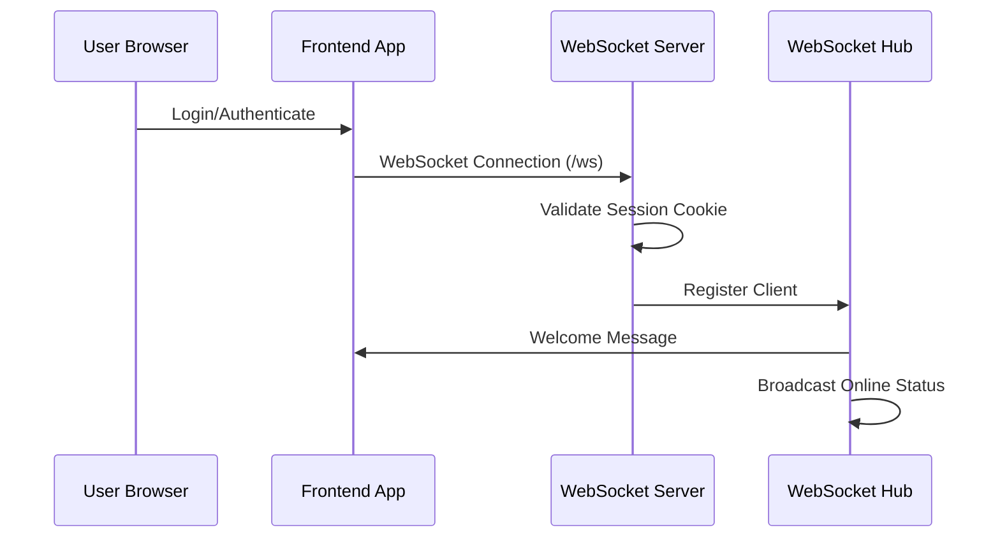
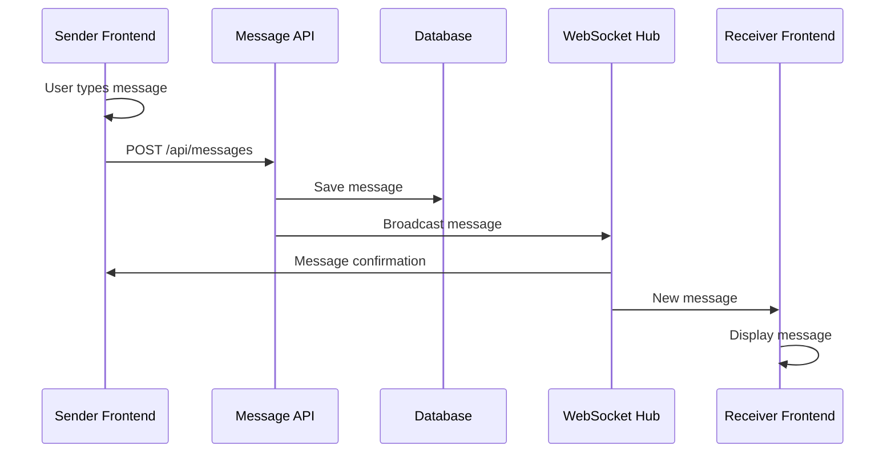
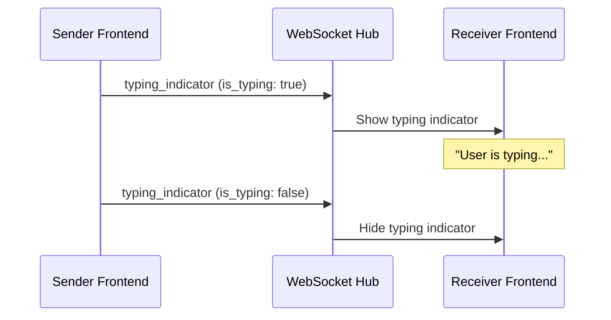

# Private Messaging WebSocket Documentation

## Overview

The private messaging system uses WebSockets to provide real-time communication between users. This document explains the complete architecture, message flow, and implementation details.

## Architecture

### Backend Components

#### 1. WebSocket Hub (`backend/pkg/websocket/hub.go`)
The central component that manages all WebSocket connections and message routing.

```go
type Hub struct {
    clients     map[*Client]bool      // All connected clients
    userClients map[int][]*Client     // User ID to clients mapping
    broadcast   chan []byte           // Message broadcasting channel
    Register    chan *Client          // Client registration
    Unregister  chan *Client          // Client disconnection
    db          *sql.DB              // Database for permissions
}
```

**Key Features:**
- Maintains active client connections
- Maps user IDs to WebSocket clients for targeted messaging
- Handles client registration/unregistration
- Validates message permissions before broadcasting

#### 2. WebSocket Client (`backend/pkg/websocket/client.go`)
Represents individual WebSocket connections.

```go
type Client struct {
    Hub      *Hub              // Reference to hub
    Conn     *websocket.Conn   // WebSocket connection
    Send     chan []byte       // Outbound message channel
    UserID   int              // Authenticated user ID
    Username string           // User's display name
}
```

**Connection Management:**
- **ReadPump**: Reads messages from client and forwards to hub
- **WritePump**: Sends messages from hub to client
- **Ping/Pong**: Keeps connection alive with periodic heartbeats

#### 3. Message Handler (`backend/pkg/handlers/message.go`)
Processes message API calls and triggers WebSocket broadcasts.

```go
func (h *MessageHandler) broadcastMessage(message *models.Message) {
    wsMessage := map[string]interface{}{
        "type":        "private_message",
        "sender_id":   float64(message.SenderID),
        "recipient_id": float64(*message.ReceiverID),
        "message":     message,
    }
    h.hub.SendMessage(messageBytes)
}
```

### Frontend Components

#### 1. WebSocket Connection (`frontend/src/hooks/useAuth.js`)
Establishes and manages the WebSocket connection.

```javascript
// Auto-connect when user authenticates
useEffect(() => {
    if (user && !websocket) {
        const ws = connectWebSocket((message) => {
            // Handle incoming messages
        });
        setWebsocket(ws);
    }
}, [user]);
```

#### 2. Message Area (`frontend/src/components/chat/MessageArea.jsx`)
Handles real-time message display and interaction.

```javascript
// WebSocket message handling
useEffect(() => {
    if (websocket) {
        const handleMessage = (event) => {
            const data = JSON.parse(event.data);
            
            if (data.type === 'private_message') {
                // Add message to conversation
                setMessageList(prev => [...prev, data.message]);
            } else if (data.type === 'typing_indicator') {
                // Show typing indicator
                setIsTyping(data.is_typing);
            } else if (data.type === 'user_online_status') {
                // Update online status
                setIsOnline(data.is_online);
            }
        };
        
        websocket.addEventListener('message', handleMessage);
        return () => websocket.removeEventListener('message', handleMessage);
    }
}, [websocket, conversation]);
```

## Message Flow

### 1. Connection Establishment



### 2. Private Message Sending



### 3. Typing Indicators



## WebSocket Message Types

### 1. Private Messages
```json
{
    "type": "private_message",
    "sender_id": 123,
    "recipient_id": 456,
    "message": {
        "id": 789,
        "content": "Hello!",
        "sender_id": 123,
        "receiver_id": 456,
        "created_at": "2024-01-01T12:00:00Z",
        "is_read": false
    }
}
```

### 2. Typing Indicators
```json
{
    "type": "typing_indicator",
    "user_id": 123,
    "recipient_id": 456,
    "is_typing": true
}
```

### 3. Online Status
```json
{
    "type": "user_online_status",
    "user_id": 123,
    "is_online": true
}
```

### 4. System Messages
```json
{
    "type": "system",
    "message": "Welcome to the chat!"
}
```

## Real-time Features

### 1. Optimistic UI Updates
- Messages appear immediately when sent (optimistic)
- Real message from WebSocket replaces optimistic message
- Failed messages are removed with error indication

```javascript
// Add optimistic message
const optimisticMessage = {
    id: `temp-${Date.now()}`,
    content: content.trim(),
    sender_id: currentUser.id,
    receiver_id: conversation.id,
    created_at: new Date().toISOString(),
    is_read: false
};

setMessageList(prev => [...prev, optimisticMessage]);

// Send to API
await messages.sendMessage(conversation.id, content.trim());
// Real message will replace optimistic via WebSocket
```

### 2. Typing Indicators
- Sent when user starts typing
- Automatically cleared after 3 seconds
- Cleared immediately when message is sent

```javascript
const sendTypingIndicator = (isTyping) => {
    if (websocket && websocket.readyState === WebSocket.OPEN) {
        const typingData = {
            type: 'typing_indicator',
            user_id: currentUser.id,
            recipient_id: conversation.id,
            is_typing: isTyping
        };
        websocket.send(JSON.stringify(typingData));
    }
};
```

### 3. Online Status
- Broadcasted when user connects/disconnects
- Real-time indicator in chat interface
- Helps users know when recipients are available

### 4. Message Read Status
- Messages marked as read when conversation is viewed
- Real-time updates via WebSocket
- Visual indicators for read/unread messages

## Security & Permissions

### 1. Authentication
- WebSocket connections require valid session cookies
- User identity verified on connection
- Unauthorized connections rejected

### 2. Message Validation
- Permission checks before message broadcasting
- Users can only send messages to allowed recipients
- Database validation for message permissions

### 3. Connection Security
- Automatic reconnection on connection loss
- Graceful handling of network interruptions
- Rate limiting and abuse prevention

## Error Handling

### 1. Connection Errors
```javascript
ws.onclose = () => {
    // Auto-reconnect after 5 seconds
    setTimeout(() => connectWebSocket(onMessage), 5000);
};

ws.onerror = (error) => {
    // Silent error handling to prevent console spam
    // Log to error tracking service in production
};
```

### 2. Message Failures
- Failed messages removed from UI
- Error notifications to user
- Retry mechanisms for temporary failures

### 3. Network Issues
- Automatic reconnection
- Message queuing during disconnection
- Graceful degradation to polling if needed

## Performance Considerations

### 1. Connection Management
- Efficient client mapping for targeted messaging
- Proper cleanup of disconnected clients
- Memory management for large user bases

### 2. Message Broadcasting
- Targeted messaging instead of broadcast to all
- Efficient JSON serialization/deserialization
- Minimal message payload sizes

### 3. Scalability
- Hub can be extended for multiple server instances
- Redis pub/sub for cross-server communication
- Load balancing for WebSocket connections

## Monitoring & Debugging

### 1. Connection Logging
```go
log.Printf("Client connected: %d", client.UserID)
log.Printf("Client disconnected: %d", client.UserID)
```

### 2. Message Tracking
- All WebSocket messages logged
- Performance metrics for message delivery
- Error tracking for failed connections

### 3. Health Checks
- Ping/pong for connection health
- Automatic cleanup of stale connections
- Monitoring of active connection counts

## Future Enhancements

1. **Message Encryption**: End-to-end encryption for sensitive messages
2. **File Sharing**: Support for image/file attachments
3. **Message Reactions**: Emoji reactions to messages
4. **Message Threading**: Reply to specific messages
5. **Push Notifications**: Mobile push notifications for offline users
6. **Message Search**: Real-time search across message history
7. **Voice Messages**: Audio message support
8. **Video Calls**: Integration with WebRTC for video calling
